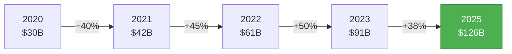
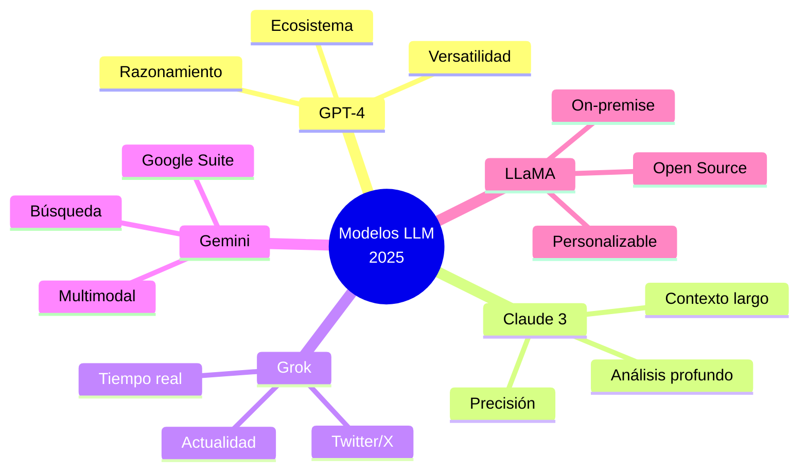
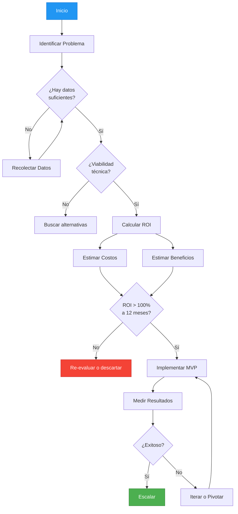
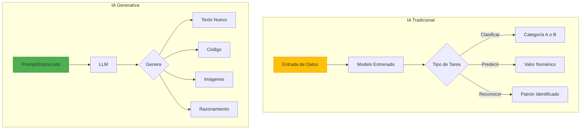
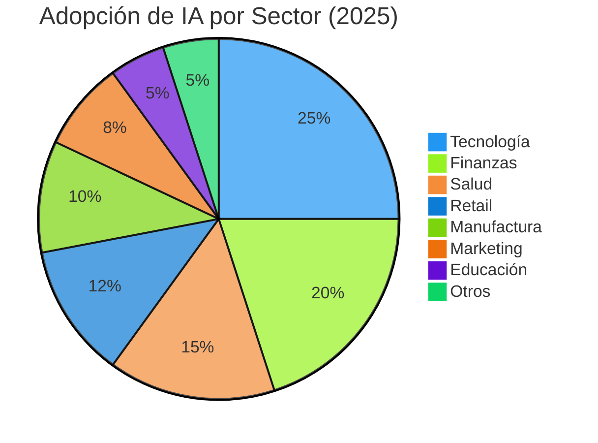
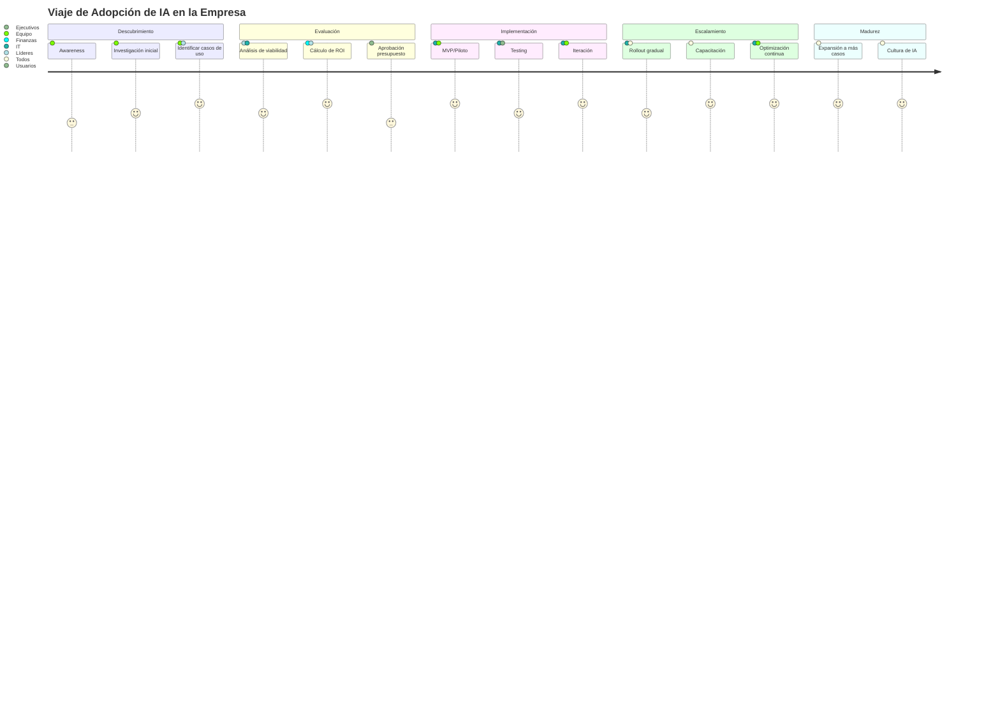
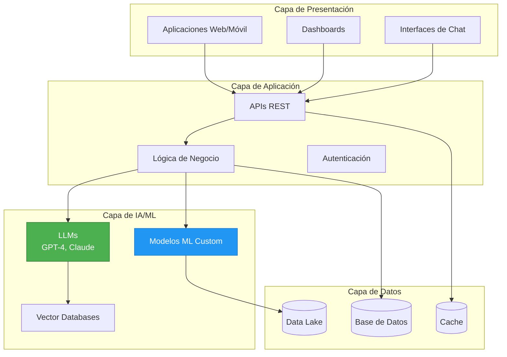
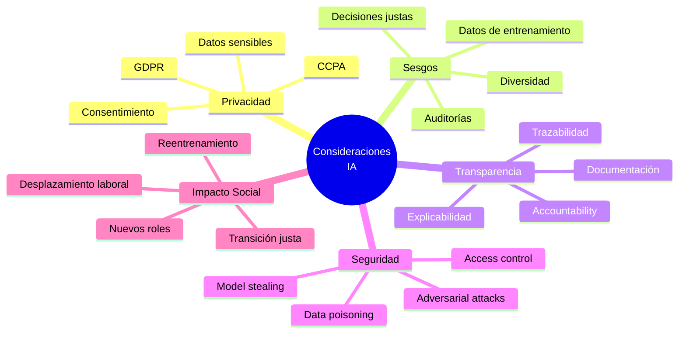
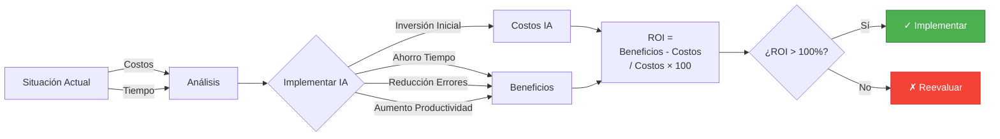
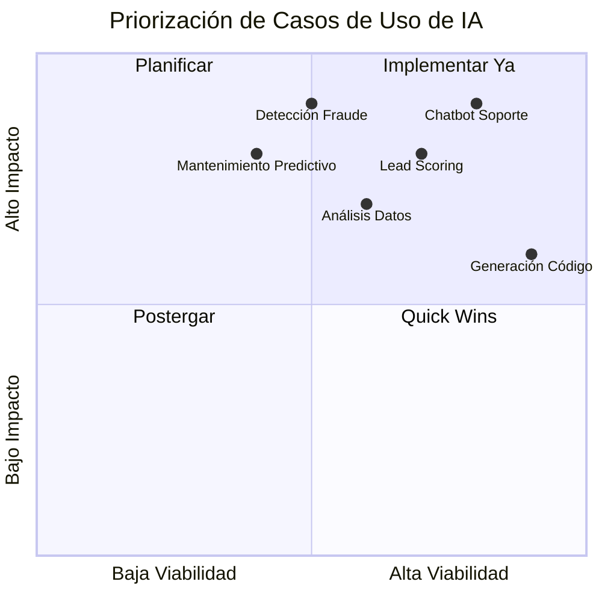

# Diagramas Visuales - Bloque 1: Fundamentos

## 1. Evolución del Mercado de IA (2020-2025)

## 2. Comparativa de Modelos LLM (2025)

## 3. Framework de Evaluación de ROI

## 4. IA Tradicional vs IA Generativa

## 5. Aplicaciones de IA por Industria

## 6. Ciclo de Adopción de IA en Empresa

## 7. Stack Tecnológico de IA

## 8. Consideraciones Éticas y Riesgos

## 9. Cálculo de ROI - Ejemplo Visual

## 10. Matriz de Priorización de Casos de Uso

## Cómo Usar Estos Diagramas

### En Presentaciones
1. Copia el código Mermaid
2. Usa herramientas como:
   - [Mermaid Live Editor](https://mermaid.live)
   - [GitHub](https://github.com) (soporte nativo)
   - [Notion](https://notion.so)
   - [Obsidian](https://obsidian.md)

### Exportar como Imagen
- Mermaid Live: Exporta a PNG, SVG, PDF
- GitHub: Screenshots
- Herramientas CLI: `mmdc` (mermaid-cli)

### Personalizar
Modifica los colores, textos y estructura según tu necesidad en el código Mermaid.
