# Diagramas Visuales - Bloque 2: Aplicaciones Empresariales

## 1. Automatización Inteligente - Flujo de Procesos

```mermaid
flowchart TD
    Start[Entrada de Tarea] --> Classify{IA Clasifica<br/>Tipo de Tarea}
    Classify -->|Repetitiva| Auto1[Automatización<br/>Total]
    Classify -->|Semi-compleja| Auto2[Asistencia IA<br/>+ Humano]
    Classify -->|Compleja| Human[Escalamiento<br/>a Experto]

    Auto1 --> Execute[IA Ejecuta]
    Execute --> Validate{Validación<br/>Automática}
    Validate -->|OK| Complete[✓ Completado]
    Validate -->|Error| Auto2

    Auto2 --> Assist[IA Sugiere]
    Assist --> HumanDecision[Humano Decide]
    HumanDecision --> Execute2[Ejecutar Acción]
    Execute2 --> Complete

    Human --> Expert[Experto Maneja]
    Expert --> Learn[IA Aprende<br/>del Proceso]
    Learn --> Complete

    style Complete fill:#4CAF50,stroke:#2E7D32,color:#fff
    style Execute fill:#2196F3,stroke:#1976D2,color:#fff
```



## 2. Arquitectura de Chatbot Empresarial


## 3. Embudo de Ventas con IA

```mermaid
%%{init: {'theme':'base', 'flowchart': {'curve': 'basis'}}}%%
graph TD
    A[1000 Leads] -->|IA Score| B{Calificación}
    B -->|Alta: 300| C[Leads Calientes]
    B -->|Media: 400| D[Leads Tibios]
    B -->|Baja: 300| E[Leads Fríos]

    C -->|IA Personaliza| F[Email Automático<br/>Personalizado]
    F --> G[150 Responden]
    G -->|IA Analiza| H[Detección de<br/>Oportunidad]
    H --> I[75 Reuniones]
    I --> J[45 Propuestas]
    J --> K[25 Cierres]

    D -->|Nurturing IA| L[Contenido<br/>Automático]
    L --> M[+100 Calientes]
    M --> C

    E -->|IA Monitorea| N[Señales de<br/>Intención]
    N --> O[+50 Tibios]
    O --> D

    style K fill:#4CAF50,stroke:#2E7D32,color:#fff,stroke-width:3px
    style C fill:#FF9800,stroke:#F57C00,color:#fff
```



## 4. Impacto de IA en Productividad por Rol

```mermaid
%%{init: {'theme':'base', 'themeVariables': { 'primaryColor':'#2196F3'}}}%%
graph LR
    subgraph "Sin IA"
        D1[Desarrollador<br/>5 proyectos/mes]
        V1[Vendedor<br/>20 leads/semana]
        S1[Soporte<br/>50 tickets/día]
        M1[Marketer<br/>10 campañas/mes]
    end

    subgraph "Con IA"
        D2[Desarrollador<br/>11 proyectos/mes<br/>+120%]
        V2[Vendedor<br/>35 leads/semana<br/>+75%]
        S2[Soporte<br/>300 tickets/día<br/>+500%]
        M2[Marketer<br/>25 campañas/mes<br/>+150%]
    end

    D1 -.IA.-> D2
    V1 -.IA.-> V2
    S1 -.IA.-> S2
    M1 -.IA.-> M2

    style D2 fill:#4CAF50,stroke:#2E7D32,color:#fff
    style V2 fill:#4CAF50,stroke:#2E7D32,color:#fff
    style S2 fill:#4CAF50,stroke:#2E7D32,color:#fff
    style M2 fill:#4CAF50,stroke:#2E7D32,color:#fff
```



## 5. Modelo Híbrido de Soporte (IA + Humano)

```mermaid
stateDiagram-v2
    [*] --> Recepción: Cliente contacta
    Recepción --> Nivel1: Triage automático

    Nivel1: Bot IA (60-70%)
    Nivel1 --> Resuelto: Pregunta simple
    Nivel1 --> Nivel2: Necesita humano

    Nivel2: Agente + IA (25-30%)
    Nivel2 --> Resuelto: Caso estándar
    Nivel2 --> Nivel3: Caso complejo

    Nivel3: Especialista (5-10%)
    Nivel3 --> Resuelto: Solución experta

    Resuelto --> Feedback: CSAT Survey
    Feedback --> [*]: Aprende y mejora

    note right of Nivel1
        IA maneja:
        - FAQs
        - Estado de pedidos
        - Info productos
        - Reseteos simples
    end note

    note right of Nivel2
        Agente con IA:
        - Historial automático
        - Sugerencias IA
        - Respuestas rápidas
    end note
```



## 6. Pipeline de Desarrollo con IA


## 7. Lead Scoring con Machine Learning


## 8. Automatización de Marketing de Contenidos


## 9. Análisis de Sentimiento en Tiempo Real

```mermaid
%%{init: {'theme':'base', 'themeVariables': { 'primaryColor':'#2196F3'}}}%%
pie title Distribución de Sentimiento - Análisis de 10,000 Comentarios
    "😊 Positivo (65%)" : 6500
    "😐 Neutral (25%)" : 2500
    "😠 Negativo (10%)" : 1000
```



## 10. ROI de Implementaciones de IA por Área

```mermaid
%%{init: {'theme':'base', 'themeVariables': { 'primaryColor':'#4CAF50'}}}%%
graph TB
    subgraph "ROI a 6 Meses"
        A[Chatbot<br/>Soporte<br/>245%]
        B[Lead Scoring<br/>Ventas<br/>380%]
        C[Code Assistant<br/>Desarrollo<br/>290%]
        D[Content Gen<br/>Marketing<br/>320%]
    end

    subgraph "ROI a 12 Meses"
        E[Detección Fraude<br/>Fintech<br/>560%]
        F[Mantenimiento<br/>Manufactura<br/>850%]
        G[BI Analytics<br/>Datos<br/>410%]
    end

    style A fill:#4CAF50,stroke:#2E7D32,color:#fff
    style B fill:#4CAF50,stroke:#2E7D32,color:#fff
    style C fill:#4CAF50,stroke:#2E7D32,color:#fff
    style D fill:#4CAF50,stroke:#2E7D32,color:#fff
    style E fill:#2196F3,stroke:#1976D2,color:#fff
    style F fill:#2196F3,stroke:#1976D2,color:#fff
    style G fill:#2196F3,stroke:#1976D2,color:#fff
```



## 11. Customer Journey con IA


## 12. Comparativa: Con y Sin IA en Soporte

```mermaid
gantt
    title Resolución de Ticket: Tradicional vs IA
    dateFormat X
    axisFormat %H:%M

    section Sin IA
    Cliente espera        :0, 24h
    Asignación manual     :24h, 2h
    Agente investiga      :26h, 4h
    Respuesta enviada     :30h, 1h
    Follow-up             :31h, 2h
    Total: 33 horas       :milestone, 33h

    section Con IA
    Bot responde          :0, 30s
    Solución automática   :30s, 30s
    CSAT                  :1min, 1min
    Total: 2 minutos      :milestone, 2min
```

## 13. Arquitectura de Sistema de IA Generativa para Empresas


## Cómo Usar Estos Diagramas

### Renderizar en Markdown
GitHub, GitLab, y muchas herramientas soportan Mermaid nativamente:
````markdown

````

### Herramientas Online
- [Mermaid Live Editor](https://mermaid.live)
- [Mermaid Chart](https://www.mermaidchart.com)

### Exportar
- PNG/SVG para presentaciones
- PDF para documentos
- Código embebido en HTML

### Personalizar
Todos los diagramas pueden modificarse cambiando:
- Colores: `style NodeID fill:#COLOR`
- Textos: Edita directamente
- Estructura: Agrega o quita nodos
