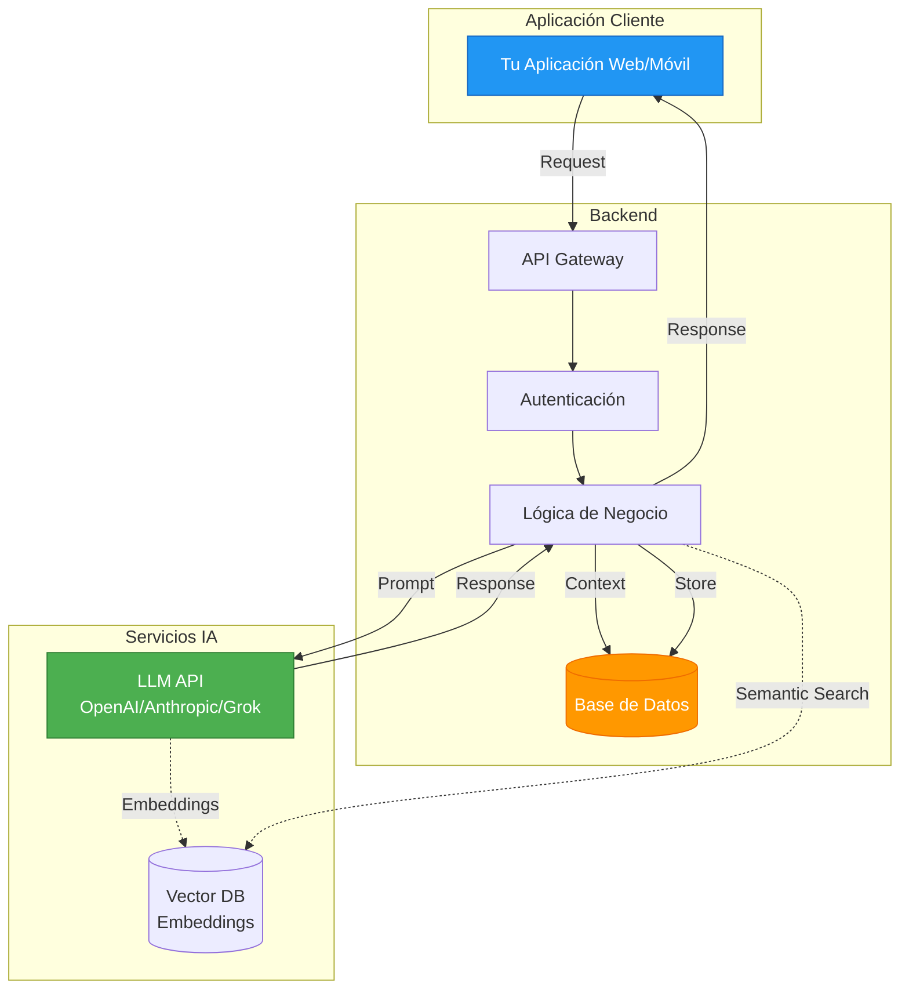
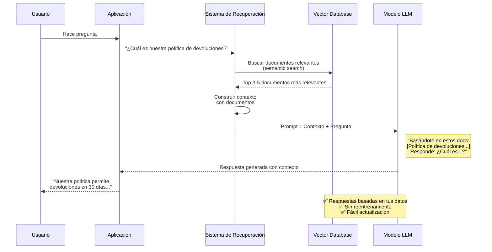
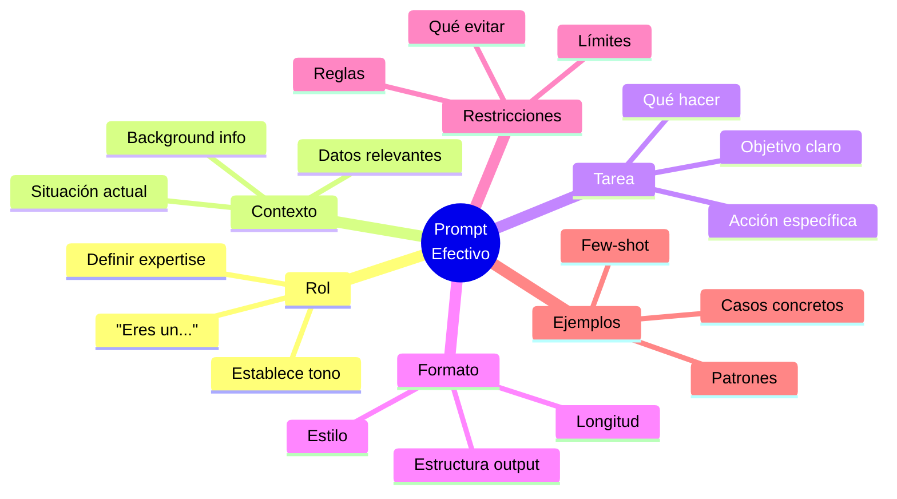
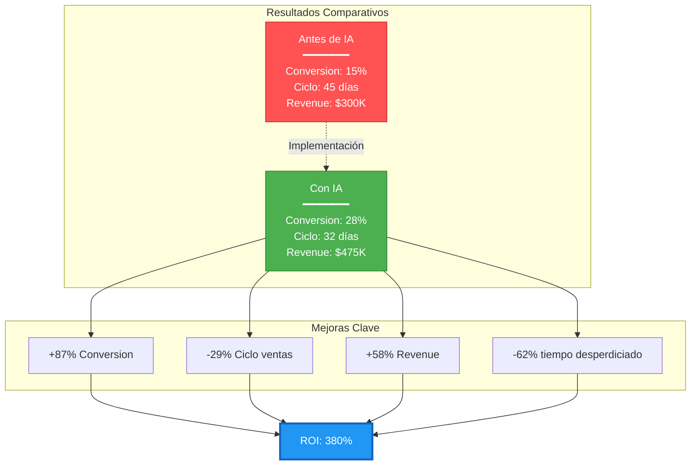
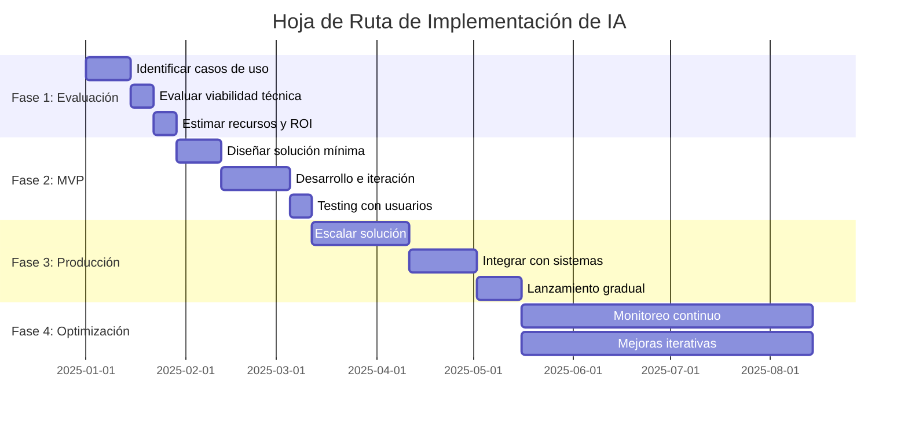

# Bloque 3: Implementación y Casos Prácticos

**Duración:** 1 hora
**Objetivo:** Llevar la teoría a la práctica con técnicas de implementación, prompt engineering y casos reales

---

## Objetivos de Aprendizaje

Al finalizar este bloque, serás capaz de:
- ✅ Diseñar arquitecturas de solución con IA
- ✅ Integrar IA con sistemas existentes (CRM, ERP, etc.)
- ✅ Dominar técnicas de prompt engineering
- ✅ Aplicar mejores prácticas de implementación
- ✅ Crear una hoja de ruta para implementación en tu empresa

---

## Contenido

### 3.1 Arquitecturas de Solución con IA

#### Stack Tecnológico Moderno

**Capas de una solución de IA:**

```
┌─────────────────────────────────────┐
│   Capa de Presentación              │
│   (UI/UX, Apps, Dashboards)         │
└─────────────────────────────────────┘
            ↓
┌─────────────────────────────────────┐
│   Capa de Aplicación                │
│   (Lógica de negocio, APIs)         │
└─────────────────────────────────────┘
            ↓
┌─────────────────────────────────────┐
│   Capa de IA/ML                     │
│   (Modelos, LLMs, APIs de IA)       │
└─────────────────────────────────────┘
            ↓
┌─────────────────────────────────────┐
│   Capa de Datos                     │
│   (Bases de datos, Data Lakes)      │
└─────────────────────────────────────┘
```

#### Patrones de Arquitectura

**1. API-First (Recomendado para la mayoría)**



**Ventajas:**
- ✅ Rápida implementación
- ✅ Sin infraestructura de ML
- ✅ Actualizaciones automáticas del modelo
- ✅ Pay-per-use

**Ejemplo de flujo:**
```javascript
// Llamada a API de OpenAI
const response = await openai.chat.completions.create({
  model: "gpt-4",
  messages: [
    {role: "system", content: "Eres un asistente de ventas"},
    {role: "user", content: userQuestion}
  ]
});
```

**2. RAG (Retrieval-Augmented Generation)**



**Ideal para:**
- Bases de conocimiento empresariales
- Documentación técnica
- Datos propietarios

**Componentes:**
- Vector database (Pinecone, Weaviate, Chroma)
- Embeddings (OpenAI, Cohere)
- LLM para generación

**3. Fine-Tuning (Para casos especializados)**

```
Modelo Base → Entrenar con tus datos → Modelo Custom
```

**Cuándo usar:**
- Terminología muy específica
- Requisitos de privacidad estrictos
- Costos a largo plazo justifican inversión

**4. Modelo Híbrido (Enterprise)**

```
Edge: Modelos pequeños locales
    ↓
Cloud: LLMs potentes para tareas complejas
    ↓
On-Premise: Datos sensibles
```

#### Consideraciones de Infraestructura

**Cloud vs On-Premise:**

| Factor | Cloud (API) | On-Premise |
|--------|-------------|------------|
| **Costo inicial** | Bajo | Alto |
| **Mantenimiento** | Proveedor | Tu equipo |
| **Escalabilidad** | Automática | Manual |
| **Privacidad** | Compartida | Total |
| **Latencia** | Media | Baja |
| **Recomendado para** | Startups, MVP | Enterprise |

**Selección de proveedor:**

| Proveedor | Fortalezas | Casos de Uso |
|-----------|-----------|--------------|
| **OpenAI** | Versatilidad, ecosistema | General purpose |
| **Anthropic** | Contexto largo, precisión | Análisis profundo |
| **Google** | Multimodal, búsqueda | Integración Google |
| **AWS/Azure** | Enterprise, integración | Infraestructura existente |
| **Open Source** | Control, privacidad | On-premise |

---

### 3.2 Integraciones con Sistemas Existentes

#### Patrones de Integración

**1. Integration via API (Más común)**

**Ejemplo: Integración con CRM (Salesforce)**

```python
# Pseudocódigo
lead = salesforce.get_lead(lead_id)
ai_analysis = openai.analyze(lead.description)
salesforce.update_lead(lead_id, {
    'priority_score': ai_analysis.score,
    'next_action': ai_analysis.recommendation
})
```

**Flujo típico:**
1. Evento en sistema (nuevo ticket, lead, pedido)
2. Webhook dispara función
3. IA procesa información
4. Resultado se envía de vuelta al sistema

**2. Middleware Pattern**

```
Sistema A ↔ Middleware con IA ↔ Sistema B
```

**Herramientas:**
- Zapier + IA
- Make (Integromat)
- n8n (open source)
- Custom con LangChain

**Ejemplo real:**
```
Email → Gmail → Zapier → GPT-4 (categorizar) → Slack (notificar)
```

**3. Embedded AI (UI Level)**

```
Tu App UI → Widget de IA → API
```

**Ejemplos:**
- Chatbot en esquina de sitio web
- Asistente en dashboard
- Sugerencias en formularios

#### Integraciones Comunes

**CRM (Salesforce, HubSpot):**
- Scoring automático de leads
- Resúmenes de conversaciones
- Sugerencias de siguiente acción
- Automatización de emails

**ERP (SAP, Oracle):**
- Predicción de demanda
- Optimización de inventarios
- Detección de anomalías
- Automatización de reportes

**Helpdesk (Zendesk, Freshdesk):**
- Clasificación de tickets
- Respuestas sugeridas
- Análisis de sentimiento
- Escalamiento inteligente

**Comunicación (Slack, Teams):**
- Bots de Q&A
- Resúmenes de conversaciones
- Recordatorios inteligentes
- Búsqueda mejorada

#### Consideraciones de Seguridad

**Mejores prácticas:**
- 🔒 Usar HTTPS para todas las comunicaciones
- 🔑 Gestión segura de API keys (variables de entorno, vaults)
- 👤 Autenticación y autorización robustas
- 📊 Logging y auditoría de accesos
- 🛡️ Rate limiting para prevenir abuso
- 🔐 Encriptación de datos sensibles

**Compliance:**
- GDPR (Europa)
- CCPA (California)
- HIPAA (salud, USA)
- SOC 2, ISO 27001

---

### 3.3 Prompting Efectivo y Prompt Engineering

#### Fundamentos de Prompt Engineering

**Qué es:**
El arte y ciencia de diseñar instrucciones efectivas para obtener los mejores resultados de modelos de IA.

#### Anatomía de un Buen Prompt



**Ejemplo básico:**
```
❌ Mal: "Escribe sobre ventas"

✅ Bien:
Eres un consultor de ventas B2B con 15 años de experiencia.

Contexto: Nuestra empresa vende software CRM a empresas de 50-500 empleados.

Tarea: Escribe un email de seguimiento para un lead que descargó nuestro whitepaper hace 3 días pero no ha respondido.

Formato: Email profesional, máximo 150 palabras, con llamado a la acción claro.

Restricciones: No mencionar precio, enfocarse en valor, tono consultivo no vendedor.
```

#### Técnicas Avanzadas

**1. Few-Shot Learning (Ejemplos)**

```
Clasifica el sentimiento de estos comentarios:

Ejemplo 1:
Input: "El producto es increíble, muy satisfecho"
Output: Positivo

Ejemplo 2:
Input: "No funciona como esperaba, decepcionante"
Output: Negativo

Ahora clasifica:
Input: "Es aceptable pero podría mejorar"
Output:
```

**2. Chain-of-Thought (Razonamiento paso a paso)**

```
Resuelve este problema paso a paso:

Problema: Un cliente quiere cancelar su suscripción porque no ve valor.

Razonamiento:
1. Identificar razones específicas de insatisfacción
2. Evaluar si usó todas las funciones
3. Calcular uso vs potencial
4. Proponer solución personalizada

Solución recomendada:
```

**3. Rol de Sistema (System Prompts)**

```javascript
{
  role: "system",
  content: `Eres un experto en análisis de datos que:
  - Siempre cita fuentes de datos
  - Explica metodología claramente
  - Identifica limitaciones del análisis
  - Usa visualizaciones cuando es apropiado`
}
```

**4. Prompt Templates**

**Template para análisis:**
```
Analiza [OBJETO] considerando:
1. Fortalezas:
2. Debilidades:
3. Oportunidades:
4. Riesgos:
5. Recomendación:

Datos: [DATOS]
```

**Template para generación de contenido:**
```
Crea [TIPO_CONTENIDO] que:
- Audiencia: [TARGET]
- Tono: [TONO]
- Longitud: [PALABRAS]
- CTA: [ACCIÓN]
- Keywords: [KEYWORDS]
```

#### Mejores Prácticas

**✅ DO's:**
- Ser específico y claro
- Dar contexto suficiente
- Usar ejemplos cuando sea posible
- Especificar formato deseado
- Iterar y refinar prompts
- Validar resultados con humanos

**❌ DON'Ts:**
- Ser vago o ambiguo
- Asumir conocimiento no explícito
- Usar jerga sin explicar
- Esperar perfección en primer intento
- Ignorar limitaciones del modelo
- Confiar ciegamente en outputs

#### Optimización de Prompts

**Framework de evaluación:**

```python
# Métricas
relevancia = 0-10  # ¿Responde la pregunta?
precisión = 0-10   # ¿Es correcta la info?
completitud = 0-10  # ¿Cubre todo lo necesario?
formato = 0-10     # ¿Sigue el formato pedido?

score_total = (relevancia + precisión + completitud + formato) / 4
```

**Proceso de refinamiento:**
1. Prompt inicial → Test → Evaluar
2. Identificar problemas específicos
3. Ajustar prompt (más contexto, ejemplos, restricciones)
4. Re-test → Comparar
5. Iterar hasta satisfacer criterios

#### Herramientas de Prompt Engineering

- **PromptBase**: Marketplace de prompts
- **LangChain**: Framework para apps con LLMs
- **Prompt Perfect**: Optimización automática
- **OpenAI Playground**: Testing de prompts
- **ChatGPT/Claude**: Iteración rápida

---

### 3.4 Casos de Estudio Reales

#### Caso 1: E-commerce - Chatbot de Soporte

**Empresa:** Retailer online mediano (500K usuarios/mes)

**Problema:**
- 5,000 tickets de soporte/mes
- Tiempo de respuesta: 24-48 horas
- 70% de preguntas repetitivas
- Costos: $25,000/mes en agentes

**Solución implementada:**
- Chatbot GPT-4 integrado en sitio
- RAG con base de conocimientos
- Escalamiento a humanos para casos complejos

**Stack tecnológico:**
```
Frontend: Widget custom (React)
Backend: Node.js + Express
IA: OpenAI GPT-4 API
Vector DB: Pinecone
Integraciones: Zendesk API
```

**Resultados después de 3 meses:**
| Métrica | Antes | Después | Mejora |
|---------|-------|---------|--------|
| Tickets/mes | 5,000 | 5,000 | - |
| Resueltos por bot | 0 | 3,500 (70%) | +70% |
| Tiempo respuesta | 36h | 30 seg | 99.9% |
| Satisfacción | 72% | 87% | +15 pts |
| Costo mensual | $25K | $12K | 52% |
| ROI a 6 meses | - | - | **245%** |

**Lecciones aprendidas:**
- ✅ Entrenar bot con conversaciones reales ayudó mucho
- ✅ Mostrar "typing..." mejora percepción
- ⚠️ Necesita humanos para ~30% de casos
- ⚠️ Actualización continua de base de conocimientos crítica

---

#### Caso 2: SaaS B2B - Lead Scoring con IA

**Empresa:** Plataforma de project management

**Problema:**
- 2,000 leads/mes
- 15% conversion rate
- Vendedores pierden tiempo en leads fríos
- Ciclo de ventas: 45 días promedio

**Solución implementada:**
- ML para scoring predictivo
- Integración con Salesforce
- Dashboard de priorización

**Stack tecnológico:**
```
CRM: Salesforce
IA: OpenAI + Custom ML model
Orquestación: Zapier + Webhooks
Analytics: Mixpanel
```



**Factores analizados por IA:**
- Tamaño de empresa
- Industria
- Comportamiento web
- Engagement con emails
- Similitud con clientes exitosos
- Señales de intención (keywords buscados)

**Resultados después de 6 meses:**
| Métrica | Antes | Después | Mejora |
|---------|-------|---------|--------|
| Conversion rate | 15% | 28% | +87% |
| Ciclo de ventas | 45 días | 32 días | 29% |
| Tiempo en leads fríos | 40% | 15% | 62% |
| Revenue/vendedor | $300K | $475K | +58% |
| ROI | - | - | **380%** |

**Lecciones aprendidas:**
- ✅ Combinar IA con intuición humana funciona mejor
- ✅ Feedback loop crucial (marcar wins/losses)
- ⚠️ Primeros 2 meses de calibración necesarios
- ⚠️ No reemplaza vendedores, los hace más efectivos

---

#### Caso 3: Fintech - Detección de Fraude

**Empresa:** Plataforma de pagos

**Problema:**
- 0.5% de transacciones fraudulentas
- Pérdidas: $2M/año
- Falsos positivos afectan UX
- Sistema de reglas anticuado

**Solución implementada:**
- ML para detección en tiempo real
- Análisis de patrones históricos
- Score de riesgo por transacción

**Stack tecnológico:**
```
ML: TensorFlow + Custom models
Real-time: Apache Kafka
Storage: PostgreSQL + Redis
Monitoring: Grafana
```

**Resultados después de 1 año:**
| Métrica | Antes | Después | Mejora |
|---------|-------|---------|--------|
| Fraude detectado | 65% | 94% | +45% |
| Falsos positivos | 8% | 2% | 75% |
| Tiempo detección | 12h | < 1 seg | 99.9% |
| Pérdidas anuales | $2M | $300K | 85% |
| ROI | - | - | **560%** |

**Lecciones aprendidas:**
- ✅ Modelos necesitan reentrenamiento mensual
- ✅ Explicabilidad importante para auditorías
- ⚠️ Balance entre seguridad y UX delicado
- ⚠️ Inversión inicial significativa pero se paga rápido

---

#### Caso 4: Manufactura - Mantenimiento Predictivo

**Empresa:** Fabricante de autopartes

**Problema:**
- Paradas no planificadas: 50 horas/mes
- Costo por hora parada: $15,000
- Mantenimiento reactivo ineficiente
- Pérdidas: $750K/mes

**Solución implementada:**
- IoT sensors en máquinas críticas
- ML para predicción de fallas
- Dashboard de alertas tempranas

**Stack tecnológico:**
```
IoT: Sensores + Azure IoT Hub
ML: Azure ML + Time series analysis
Visualization: Power BI
Integration: SAP ERP
```

**Resultados después de 8 meses:**
| Métrica | Antes | Después | Mejora |
|---------|-------|---------|--------|
| Paradas no planificadas | 50 h/mes | 12 h/mes | 76% |
| Costo por paradas | $750K/mes | $180K/mes | 76% |
| Precisión predicción | - | 89% | - |
| Ahorro anual | - | $6.8M | - |
| ROI | - | - | **850%** |

**Lecciones aprendidas:**
- ✅ IoT + IA = combinación poderosa
- ✅ Inicio con máquinas más críticas funciona
- ⚠️ Requiere buy-in de operaciones
- ⚠️ Cultura de mantenimiento debe cambiar

---

### 3.5 Hoja de Ruta para Implementación

#### Roadmap Visual de Implementación



#### Fase 1: Evaluación y Planificación (2-4 semanas)

**Actividades:**
1. **Identificar casos de uso**
   - Workshop con stakeholders
   - Análisis de procesos
   - Priorización por ROI

2. **Evaluar viabilidad técnica**
   - ¿Hay datos suficientes?
   - ¿Sistemas tienen APIs?
   - ¿Equipo tiene skills necesarios?

3. **Estimar recursos**
   - Presupuesto (herramientas + equipo)
   - Timeline realista
   - KPIs de éxito

**Entregable:** Documento de caso de negocio

---

#### Fase 2: MVP / Prueba de Concepto (4-8 semanas)

**Actividades:**
1. **Diseñar solución mínima**
   - Scope muy limitado
   - Caso de uso único
   - Stack simple

2. **Implementar y probar**
   - Desarrollo rápido
   - Testing con usuarios reales
   - Iteración basada en feedback

3. **Medir resultados**
   - KPIs definidos en fase 1
   - Validar hipótesis de ROI
   - Documentar lecciones

**Entregable:** MVP funcionando + métricas

---

#### Fase 3: Producción (2-4 meses)

**Actividades:**
1. **Escalar solución**
   - Robustez y error handling
   - Monitoreo y alertas
   - Documentación

2. **Integrar con sistemas**
   - APIs y webhooks
   - Testing de integración
   - Capacitación de usuarios

3. **Lanzamiento gradual**
   - Beta con grupo pequeño
   - Feedback y ajustes
   - Rollout completo

**Entregable:** Solución en producción

---

#### Fase 4: Optimización Continua (Ongoing)

**Actividades:**
1. **Monitoreo de performance**
   - Dashboards de métricas
   - Alertas de anomalías
   - Reportes periódicos

2. **Mejora iterativa**
   - Refinar prompts
   - Ajustar modelos
   - Agregar funcionalidades

3. **Expansión**
   - Nuevos casos de uso
   - Más usuarios/procesos
   - Integración de feedback

**Entregable:** Roadmap de mejoras

---

#### Checklist de Implementación

**✅ Pre-lanzamiento:**
- [ ] Caso de negocio aprobado
- [ ] Presupuesto asignado
- [ ] Equipo definido (roles y responsabilidades)
- [ ] Stack tecnológico seleccionado
- [ ] Plan de pruebas diseñado
- [ ] KPIs y métricas de éxito definidos
- [ ] Stakeholders alineados

**✅ Durante desarrollo:**
- [ ] MVP funcionando
- [ ] Testing con usuarios reales
- [ ] Documentación técnica
- [ ] Plan de capacitación creado
- [ ] Monitoreo configurado
- [ ] Backup y disaster recovery
- [ ] Compliance verificado

**✅ Post-lanzamiento:**
- [ ] Usuarios capacitados
- [ ] Soporte técnico activo
- [ ] Métricas siendo monitoreadas
- [ ] Feedback loop establecido
- [ ] Plan de optimización continua
- [ ] Documentación de lecciones aprendidas

---

## Recursos

### Templates y Frameworks

**📋 Disponibles en `code-snippets/`:**
- `business-case-template.md` - Template de caso de negocio
- `prompt-library.md` - Biblioteca de prompts reutilizables
- `integration-checklist.md` - Checklist de integración
- `roi-calculator.xlsx` - Calculadora de ROI avanzada
- `implementation-roadmap.md` - Roadmap de implementación
- `monitoring-dashboard.md` - Métricas para monitorear

### Código de Ejemplo

**🔧 En `code-snippets/code-examples/`:**
- `openai-integration.py` - Integración básica con OpenAI
- `rag-pipeline.py` - Sistema RAG completo
- `chatbot-widget.js` - Widget de chatbot para web
- `lead-scoring.py` - ML para scoring de leads
- `slack-bot.js` - Bot de Slack con IA

### Herramientas Recomendadas

**Development:**
- LangChain - Framework para apps con LLMs
- LlamaIndex - Framework para RAG
- Vercel AI SDK - React para IA
- Streamlit - Prototipado rápido

**Testing:**
- OpenAI Playground
- Claude.ai
- PromptPerfect
- LangSmith (debugging)

**Monitoring:**
- Langfuse - Observabilidad para LLMs
- Helicone - Analytics y caching
- LangSmith - Tracing y debugging
- Weights & Biases - Experimentos ML

---

## Ejercicios Prácticos

### Ejercicio 1: Diseñar Arquitectura (30 min)
**Objetivo**: Diseñar arquitectura para un caso real

**Instrucciones**:
1. Selecciona un caso de uso de tu empresa
2. Diseña:
   - Diagrama de arquitectura
   - Stack tecnológico justificado
   - Flujo de datos
   - Integraciones necesarias
3. Identifica riesgos y mitigaciones

**Template**: `code-snippets/arquitectura-template.md`

---

### Ejercicio 2: Prompt Engineering Challenge (30 min)
**Objetivo**: Crear prompts efectivos para casos reales

**Instrucciones**:
1. Toma 3 casos de uso:
   - Análisis de datos
   - Generación de contenido
   - Clasificación/categorización
2. Para cada uno:
   - Escribe prompt inicial
   - Prueba con IA real
   - Itera y mejora
   - Documenta mejores prácticas
3. Comparte resultados

**Herramienta**: ChatGPT o Claude

---

### Ejercicio 3: Plan de Implementación (30 min)
**Objetivo**: Crear roadmap para implementar IA en tu empresa

**Instrucciones**:
1. Selecciona caso de uso prioritario
2. Completa:
   - Fase 1: Evaluación (qué analizar)
   - Fase 2: MVP (qué construir)
   - Fase 3: Producción (cómo escalar)
   - Fase 4: Optimización (cómo mejorar)
3. Define:
   - Timeline realista
   - Presupuesto estimado
   - Recursos necesarios
   - KPIs de éxito
4. Presenta a tu equipo

**Template**: `code-snippets/implementation-plan.md`

---

## Referencias

### Estudios de Caso Completos
- 📄 "How Stripe Built their ML Platform" - Stripe Engineering
- 📄 "Shopify's AI Journey" - Shopify Engineering
- 📄 "Netflix Recommendations at Scale" - Netflix Tech Blog
- 📄 "Airbnb ML Infrastructure" - Airbnb Engineering

### Guías Técnicas
- 📘 OpenAI Cookbook - Best practices y ejemplos
- 📘 Anthropic Prompt Library - Prompts avanzados
- 📘 LangChain Documentation - Framework completo
- 📘 "Building LLM Apps" - Full Stack Deep Learning

### Frameworks y Metodologías
- 🎯 CRISP-DM - Metodología para proyectos de data
- 🎯 MLOps - Operacionalización de ML
- 🎯 Agile for AI - Desarrollo ágil adaptado a IA
- 🎯 Responsible AI - Consideraciones éticas

### Comunidades y Recursos
- 💬 r/MachineLearning (Reddit)
- 💬 LangChain Discord
- 💬 AI Stack Devs (Slack)
- 💬 MLOps Community

---

## Conclusión y Próximos Pasos

### Resumen del Curso

Has aprendido:
- ✅ Fundamentos de IA generativa y su impacto ($126B mercado)
- ✅ Aplicaciones específicas en 5+ áreas empresariales
- ✅ Arquitecturas y patrones de implementación
- ✅ Técnicas de prompt engineering
- ✅ Casos reales con ROI de 200-800%

### Acciones Inmediatas

**Esta semana:**
1. Identifica 1-2 procesos en tu empresa para IA
2. Prueba ChatGPT/Claude con prompts específicos
3. Calcula ROI potencial con template

**Este mes:**
1. Presenta caso de negocio a stakeholders
2. Forma equipo de implementación
3. Inicia MVP con caso de uso prioritario

**Este trimestre:**
1. Lanza MVP en producción
2. Mide KPIs y ajusta
3. Planifica expansión a más casos de uso

### Recursos Continuos

**Newsletters:**
- The Batch (Andrew Ng)
- Import AI (Jack Clark)
- TLDR AI (Daily digest)

**Cursos avanzados:**
- DeepLearning.AI - Especialización en IA
- Fast.ai - Práctico y hands-on
- Andrew Ng - Machine Learning

**Certificaciones:**
- Google Cloud ML Engineer
- AWS ML Specialty
- Microsoft Azure AI Engineer

---

**¡Gracias por participar!**

**Tiempo estimado de estudio**: 60 minutos
**Última actualización**: 2025

---

### Feedback y Contacto

📧 Para consultas sobre el curso: [tu-email]
💼 LinkedIn: [tu-perfil]
🌐 Recursos adicionales: [tu-sitio]
