# Diagramas Visuales - Bloque 3: Implementación y Casos Prácticos

## 1. Arquitectura API-First (Más Común)

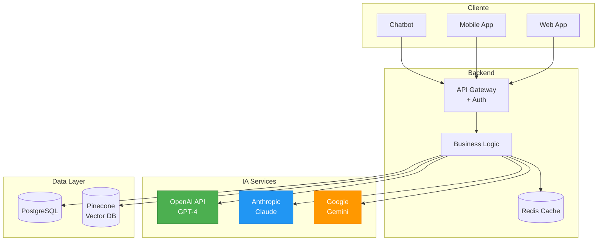

## 2. RAG (Retrieval-Augmented Generation) Pipeline

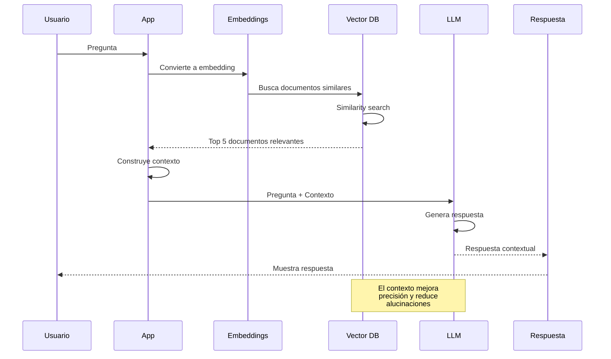

## 3. Roadmap de Implementación (4 Fases)

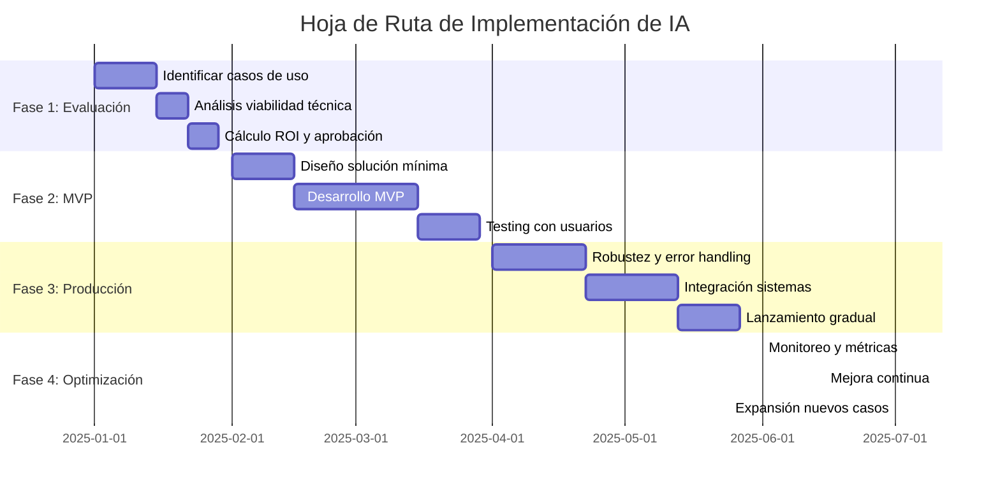

## 4. Anatomía de un Prompt Efectivo

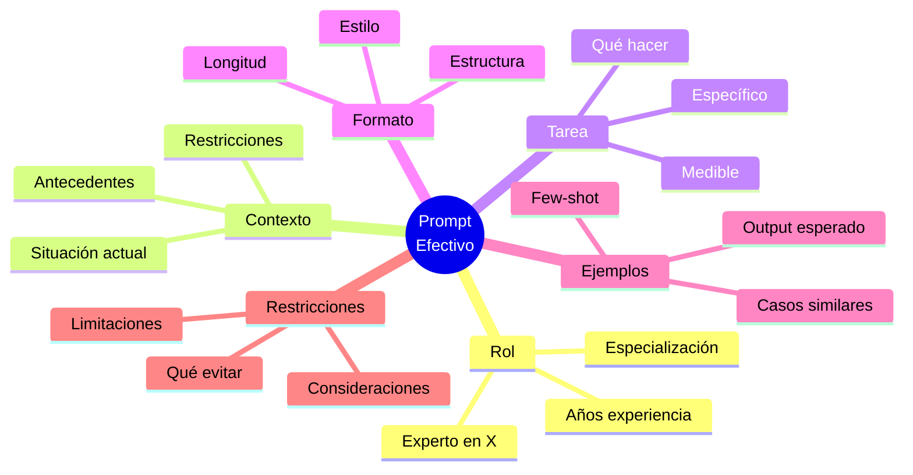

## 5. Técnicas de Prompt Engineering

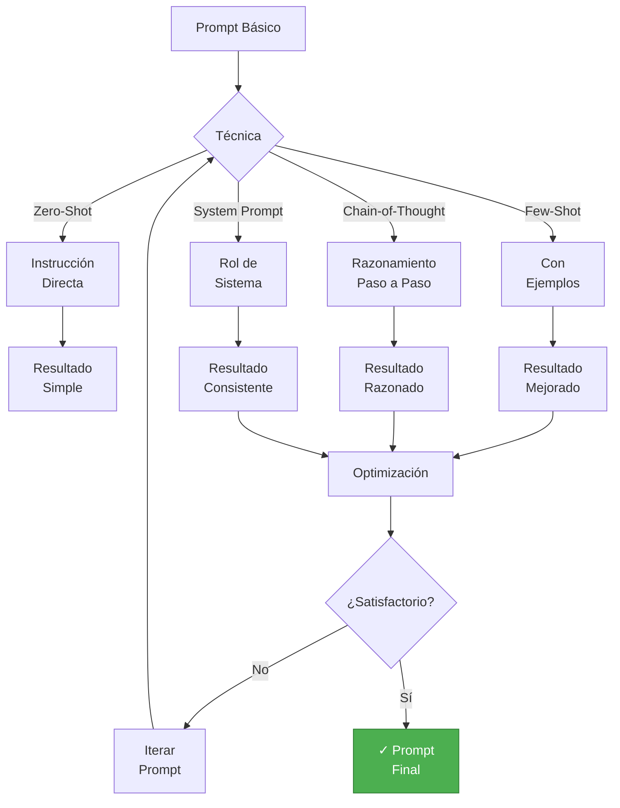

## 6. Caso de Éxito: E-commerce Chatbot

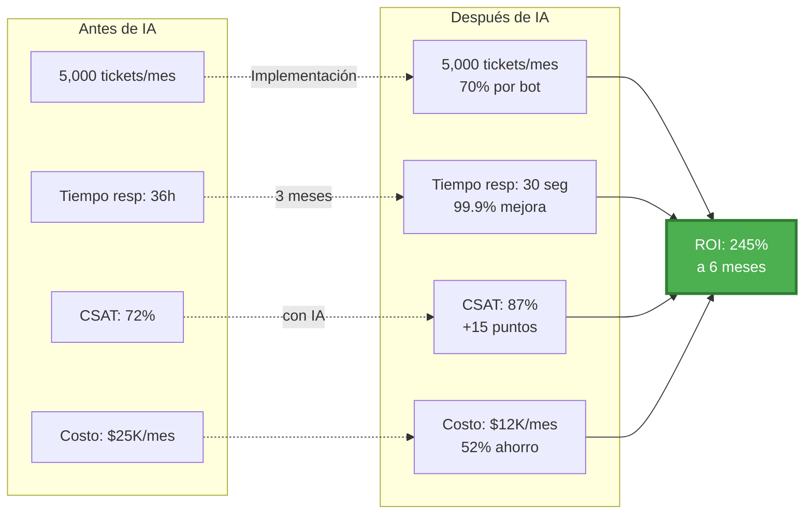

## 7. Stack Tecnológico de Caso Real

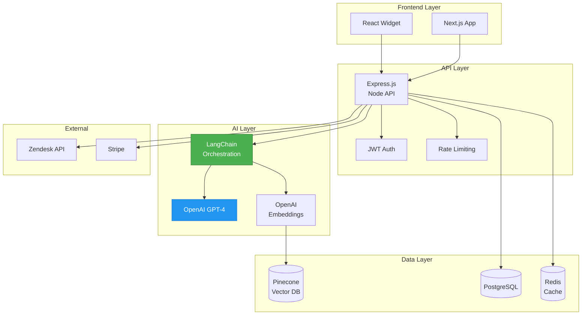

## 8. Patrones de Integración

```mermaid
graph TD
    subgraph "Patrón 1: API Direct"
        A1[Tu App] --> A2[API IA]
        A2 --> A3[Resultado]
    end

    subgraph "Patrón 2: Middleware"
        B1[Sistema A] --> B2[Middleware<br/>con IA]
        B2 --> B3[Sistema B]
    end

    subgraph "Patrón 3: Event-Driven"
        C1[Evento] --> C2[Queue]
        C2 --> C3[Worker<br/>+ IA]
        C3 --> C4[Resultado]
    end

    subgraph "Patrón 4: Embedded"
        D1[UI] --> D2[Widget IA<br/>Embebido]
        D2 --> D3[Backend]
    end

    style A2 fill:#4CAF50,stroke:#2E7D32,color:#fff
    style B2 fill:#4CAF50,stroke:#2E7D32,color:#fff
    style C3 fill:#4CAF50,stroke:#2E7D32,color:#fff
    style D2 fill:#4CAF50,stroke:#2E7D32,color:#fff
```

## 9. Comparativa ROI de Casos de Estudio

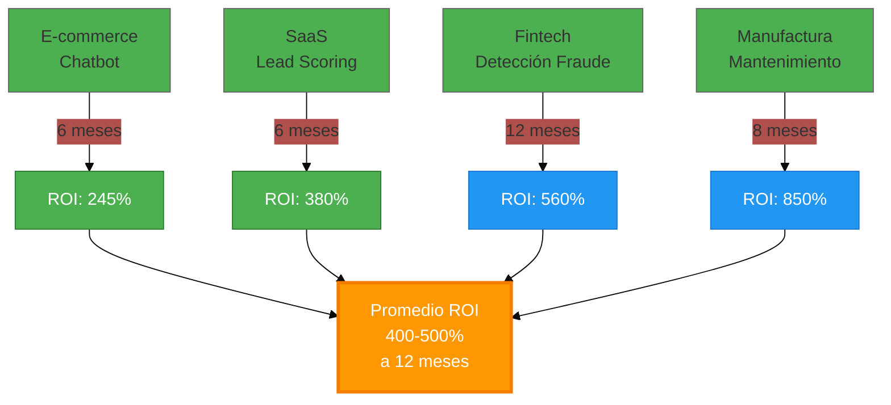

## 10. Ciclo de Mejora Continua de Prompts

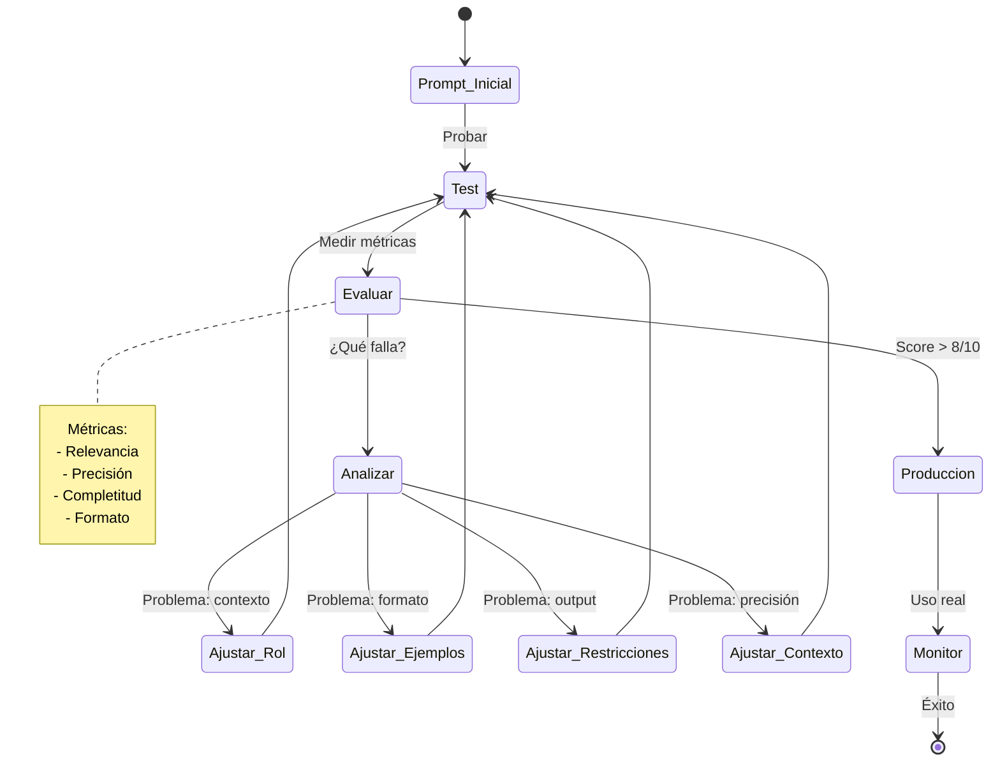

## 11. Checklist de Implementación Visual

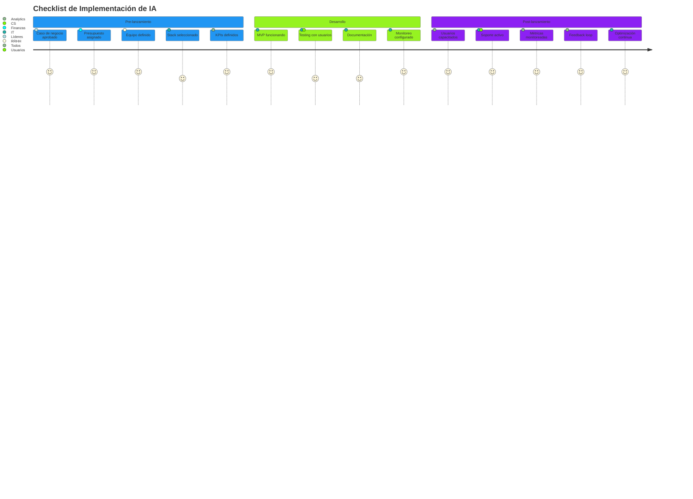

## 12. Seguridad y Compliance

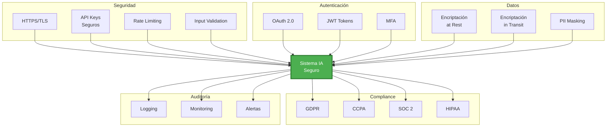

## 13. Cloud vs On-Premise Decision Tree

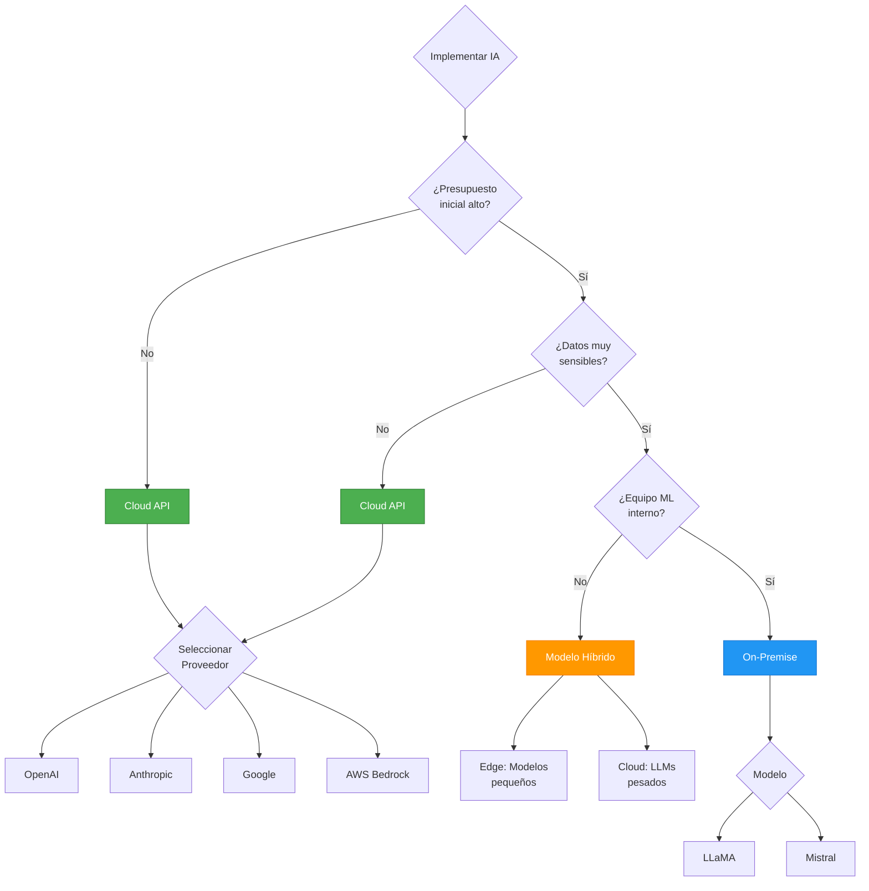

## 14. Monitoreo de Sistema de IA en Producción

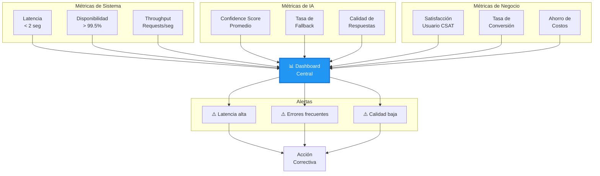

## 15. Framework de Testing de IA

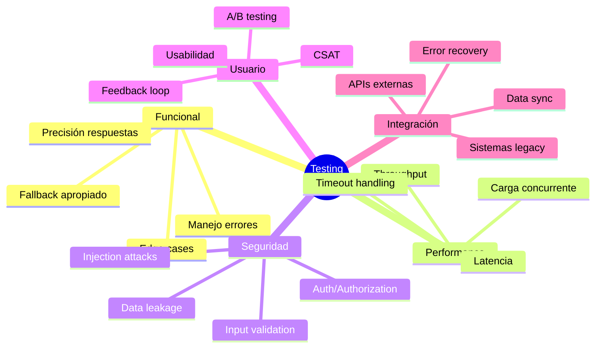

## 16. Evolución de Madurez en IA

```mermaid
%%{init: {'theme':'base'}}%%
timeline
    title Niveles de Madurez en IA Empresarial
    section Nivel 1: Experimental
        Pilotos aislados : Scope limitado : Sin integración
    section Nivel 2: Operacional
        Casos de uso específicos : Integración básica : Métricas iniciales
    section Nivel 3: Estratégico
        Múltiples casos de uso : Integración completa : ROI demostrado
    section Nivel 4: Transformacional
        IA en core business : Cultura de IA : Ventaja competitiva
    section Nivel 5: Innovador
        IA como diferenciador : Modelos propios : Liderazgo mercado
```

## Cómo Usar Estos Diagramas

### En GitHub/GitLab
Los diagramas Mermaid se renderizan automáticamente en archivos `.md`

### Herramientas Recomendadas
- **[Mermaid Live](https://mermaid.live)**: Editor online
- **VSCode**: Extensión "Markdown Preview Mermaid Support"
- **Obsidian**: Soporte nativo
- **Notion**: Soporte con plugins

### Exportar
```bash
# Instalar mermaid-cli
npm install -g @mermaid-js/mermaid-cli

# Convertir a imagen
mmdc -i diagram.mmd -o diagram.png
```

### Personalizar Estilos
```mermaid
%%{init: {
  'theme': 'base',
  'themeVariables': {
    'primaryColor': '#4CAF50',
    'primaryTextColor': '#fff',
    'primaryBorderColor': '#2E7D32'
  }
}}%%
```

### Tips
1. Mantén diagramas simples y enfocados
2. Usa colores para resaltar lo importante
3. Agrega notas explicativas cuando sea necesario
4. Prueba en Mermaid Live antes de commitear
